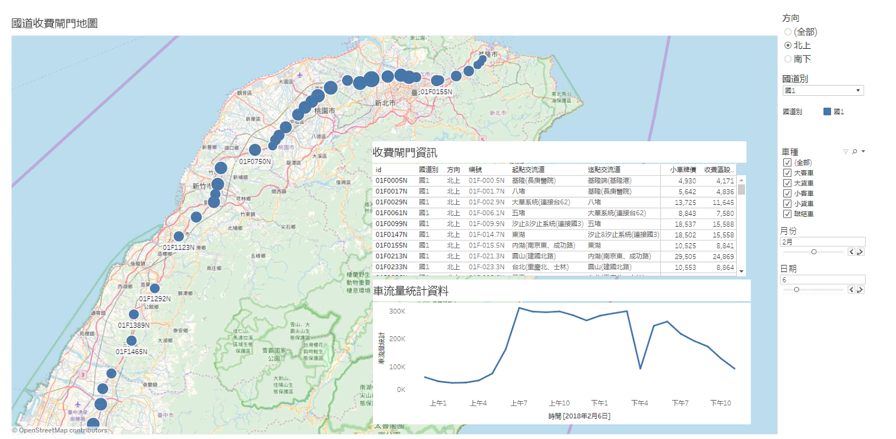

# highway

高工局提供的資料連結: <a href="http://tisvcloud.freeway.gov.tw/">點我</a>

這次利用高公局的開放資料進行一些分析與視覺化的部分

在整理完資料之後，深深地覺得當初收費閘門應該做在交流道的

因為旅次資料中的距離完全無法用來計算平均旅行速率

不過原始旅次資料還是可以用來進行一些統計與分析

<h2>步驟說明:</h2>
<li><a href="src/Download.sh">Download.sh</a>: 從高公局歷史資料下載前一天的eTag收費資料</li>
<li><a href="src/CalHourly.py">CalHourly.py</a>: 取出車種及原始旅次資料，處理之後轉換成經過每個閘門的時段</li>
<li><a href="src/AggDaily.py">AggDaily.py</a>: 利用上一步處理好的資料，將一整天個閘門完整的車輛通過資料依小時進行統計</li>
<li><a href="src/GateList.sh">GateList.sh</a>: 下載收費閘門的詳細資訊，包括ID、經緯度、里程數等</li>

<li>視覺化: 最後利用<a href="https://public.tableau.com/views/highway_statistics/Dashboard1?:embed=y&:display_count=yes&publish=yes">Tableau</a>進行視覺化的呈現</li>
</img>

<h2>超速取締役</h2>

最近新聞中有提到政府有意從高速公路資料中進行取締超速案件，究竟這個方法到底可不可行呢?

這邊來實作一下，看到底成效如何

<a href="http://nbviewer.jupyter.org/github/mirage7714/highway/src/highway_overspeed_discussion.ipynb">點我</a>

實作完的心得: 

<li>資料內有部分資料仍然是有待清理的，如果現在貿然使用可能會造成一些爭議</li>
<li>如果最後這個方法確定被採用的話，一年能傳入的罰單收入是一個滿驚人的財源，比過去的測速照相機有效多了</li>
